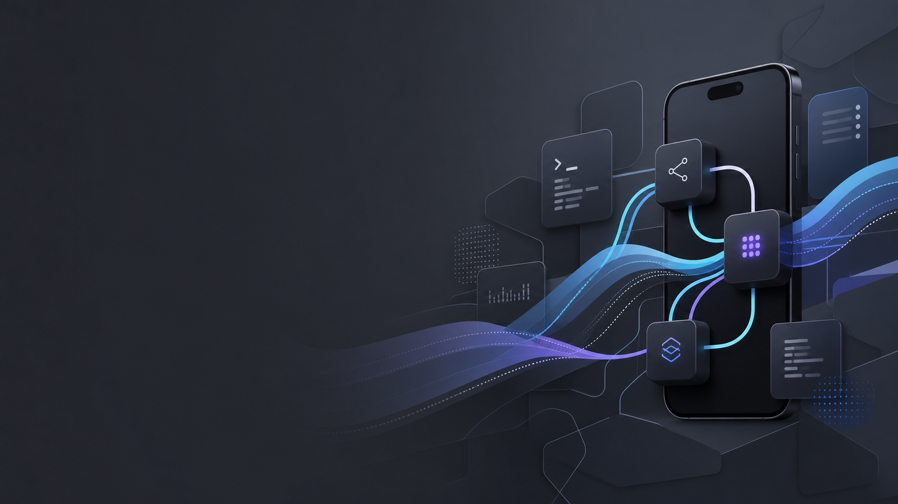
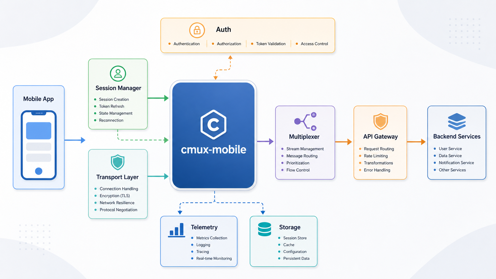

<h1 align="center">Cmux Mobile</h1>

<p align="center">
  Watch and control your <strong>Claude Code</strong>, <strong>Codex</strong>, and
  <strong>cmux</strong> sessions from <strong>any phone — iOS <em>and</em> Android</strong>.
</p>

<p align="center">
  <strong>English</strong> · <a href="README.ko.md">한국어</a>
</p>

<p align="center">
  
  
  
</p>

<p align="center">
  
</p>

---

## What this is

A fork of **[lim-won/cmux-iphone](https://github.com/lim-won/cmux-iphone)** (MIT) that makes the
mobile client **cross-platform**. The upstream project ships a native SwiftUI app for iPhone +
Apple Watch; this fork turns the bridge's built-in web client into an **installable PWA** so the
same live session mirror, prompt input, and permission approvals work on **Android Chrome** too —
no Kotlin/Flutter app required.

It also makes the mobile client a real **cmux controller**: your cmux workspaces show up by their
actual **names**, and you can open a live terminal, type into it, send keys, and start new sessions
right from the phone.

> **Why no native Android app?** The bridge already serves a complete mobile client at `GET /`
> (pairing, live SSE terminal mirror, approvals, prompt send) using only `fetch`, `EventSource`,
> and `localStorage` — all of which work identically in Android Chrome and iOS Safari. So
> "support Android" means *serve that page to Android* and make it installable. The native iOS app
> stays the iOS-premium path; the web client is the universal one.

## How it works

```
   phone (any browser / iOS app)  ──HTTP POST──►  cmux-iphone bridge (Node, on your Mac)
                                  ◄──SSE stream──   serves the web client at GET /
                                                    ├─ Claude Code  → hooks
                                                    ├─ cmux         → control-socket RPC (live mirror)
                                                    └─ Codex        → log + pinned terminal
```

<p align="center">
  
</p>

Everything runs **on your own machines** — no cloud, no account. The bridge is loopback-only by
default; expose it over a trusted LAN or a Tailscale tailnet. Auth is a pairing code + per-device
token.

> **Each install is your own.** The repo is just code — it contains no addresses, no pairing codes,
> no secrets. When *you* run setup, your Mac generates its **own** random pairing code and binds to
> **your** machine's address. Your phone pairs with **your** Mac. Nobody connects to anyone else's.

## Install

### 1. The bridge (on your Mac)

```bash
cd skill/bridge
npm ci
node bin/cmux-iphone.js setup     # installs Claude Code hooks (backs up settings) + picks a runner
node bin/cmux-iphone.js pair      # prints YOUR 6-digit pairing code
```

`setup` is idempotent and backs up `~/.claude/settings.json` before merging its (scoped) hooks.
With cmux present it runs the bridge *inside* cmux so the live mirror works.

### 2. Let your phone reach it

The bridge binds to loopback by default. Expose it on the interface you'll connect over:

```bash
node bin/cmux-iphone.js status                 # shows your LAN + Tailscale addresses
node bin/cmux-iphone.js setup --bind 100.x.y.z # bind to your Tailscale IP (encrypted, recommended)
# or --lan for the whole local network (plaintext — trusted networks only)
```

- **Same Wi-Fi:** use the LAN address from `status` (e.g. `http://192.168.x.x:7860/`).
- **Anywhere:** install [Tailscale](https://tailscale.com) on Mac + phone (same account), use the `100.x.y.z` address.
- **Phone hotspot / tethering:** bind `0.0.0.0` and connect on the hotspot-subnet address `status` reports.

### 3. Connect from your phone

1. Open the bridge address in **Chrome (Android)** or **Safari (iOS)**.
2. Enter your **pairing code** (`cmux-iphone pair`).
3. You're in — live terminal mirror, prompts, approvals, and the cmux workspace view (▦).

### 4. Install as an app

- **iOS:** Share → **Add to Home Screen** → launches standalone (works on plain HTTP).
- **Android:** for a true installable PWA, serve over HTTPS — `tailscale serve --bg --https=443 http://127.0.0.1:7860`, then open `https://<your-mac>.<tailnet>.ts.net/` and Chrome will offer **Install app**.

Full cross-platform notes (Bonjour auto-discovery, tethering, security posture) are in
[`ANDROID.md`](ANDROID.md). For the **native iOS app** (Xcode build) and bridge internals, see
[`README.upstream.md`](README.upstream.md).

## What this fork adds

| File | Change |
|---|---|
| `skill/bridge/manifest.webmanifest`, `sw.js`, `icons/` | PWA shell — installable on iOS/Android; SW never caches `/events`, `/command`, `/status`, `/cmux/*` |
| `skill/bridge/webclient.html` | manifest/SW injection + **cmux workspace view (▦)**: real names, live terminal, text/key input, new-session button |
| `skill/bridge/server.js` | PWA static routes + `POST /cmux/input · /cmux/key · /cmux/new` (all auth-gated; `new` command allowlisted — no arbitrary shell from the phone) |
| `skill/bridge/cmux.js` | `newWorkspace()` + `ctrl-c` key |
| `skill/bridge/verify-pwa.sh`, `verify-cmux.sh` | deterministic gates (routes, SW bypass, cmux control + negative paths) |

The native iOS app, the bridge core, and the CLI are unchanged from upstream.

## Verification

```bash
bash skill/bridge/verify-pwa.sh    # syntax, 14/14 upstream unit tests, PWA routes 200, SW bypass
bash skill/bridge/verify-cmux.sh   # cmux tree/new/input/screen/key + negative paths (needs bridge running)
```

## License & attribution

MIT — see [`LICENSE`](LICENSE). This is a fork of
[lim-won/cmux-iphone](https://github.com/lim-won/cmux-iphone) (MIT), itself a fork of
[shobhit99/claude-watch](https://github.com/shobhit99/claude-watch) (MIT). Original-author
copyrights are preserved; see [`NOTICE.md`](NOTICE.md). The app ships neutral icons — "Claude" and
"Codex" are trademarks of Anthropic and OpenAI respectively, used only as text labels. Independent
community tool, not affiliated with or endorsed by Anthropic or OpenAI.
